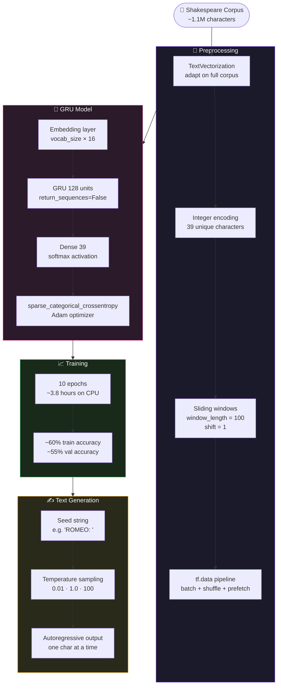

<!-- ████████████████████████████████  HEADER  ████████████████████████████████ -->


<!-- ████████████████████████████████  TYPING  ████████████████████████████████ -->

<div align="center">

[](https://git.io/typing-svg)

</div>

<br/>

<!-- ████████████████████████████████  BADGES  ████████████████████████████████ -->

<div align="center">

[](https://python.org)
[](https://tensorflow.org)
[](.)
[](https://jupyter.org)
[](.)
[](.)
[](.)

</div>

<br/>

---

<!-- ████████████████████████████████  ABOUT  ████████████████████████████████ -->

## 🧠 Project Overview

```python
class ShakeGen:
    def __init__(self):
        self.authors   = ["Anisha Singla", "Partner"]
        self.course    = "AASD-4011 — Advanced Mathematics for Deep Learning"
        self.college   = "George Brown College · Winter 2023"
        self.task      = "Character-level text generation — fake Shakespearean prose"
        self.dataset   = "Complete works of Shakespeare (~1.1M characters)"
        self.reference = "Aurélien Géron — Hands-On Machine Learning (3rd Ed.)"

    @property
    def architecture(self):
        return {
            "embedding"  : "Embedding(vocab_size, 16) — dense char vectors",
            "recurrent"  : "GRU(128)                 — gated recurrent unit",
            "output"     : "Dense(39, softmax)        — 39 unique characters",
            "window"     : "100 characters            — sliding-window sequences",
            "training"   : "10 epochs · ~3.8 hours   — tensorflow-cpu",
            "result"     : "~60% train acc · ~55% val acc",
        }

    def generate(self, seed: str, temperature: float = 1.0) -> str:
        # Temperature controls creativity vs coherence
        # Low  (0.01) → repetitive but coherent
        # Mid  (1.0)  → balanced
        # High (100)  → chaotic, random
        return autoregressive_sample(seed, temperature)
```

> Feed the complete works of Shakespeare into a GRU network — one character at a time — and watch it learn to hallucinate new Shakespearean prose. A character-level language model before transformers made it look easy.

---

<!-- ████████████████████████████████  PIPELINE  ████████████████████████████████ -->

## 🔁 End-to-End Pipeline



---

<!-- ████████████████████████████████  MODEL  ████████████████████████████████ -->

## 🤖 Model Architecture

```
Input: integer-encoded character sequence (window = 100)
    ↓
Embedding(vocab_size, 16)       — maps each char ID to a 16-dim dense vector
    ↓
GRU(128)                        — gated recurrent unit, captures sequential dependencies
    ↓
Dense(39, activation='softmax') — probability distribution over 39 unique characters
```

```python
model = tf.keras.Sequential([
    tf.keras.layers.Embedding(input_dim=vocab_size, output_dim=16),
    tf.keras.layers.GRU(128),
    tf.keras.layers.Dense(len(char_vocab), activation="softmax")
])

model.compile(
    loss     = "sparse_categorical_crossentropy",
    optimizer = "adam",
    metrics  = ["accuracy"]
)
```

---

<!-- ████████████████████████████████  TEMPERATURE  ████████████████████████████████ -->

## 🌡️ Temperature Sampling — Creativity vs Coherence

<div align="center">

| Temperature | Behaviour | Output Style |
|:---:|:---|:---|
| `0.01` | Near-deterministic — always picks the most likely character | Repetitive, highly coherent, but boring |
| `1.0` | Balanced — samples proportionally to learned probabilities | Natural-sounding Shakespearean text |
| `100` | Near-uniform — almost random character selection | Chaotic, creative, mostly incoherent |

</div>

```python
def next_char(text, temperature=1.0):
    encoded = preprocess([text])
    logits  = model.predict(encoded)[0][-1]
    scaled  = logits / temperature          # divide logits by temperature
    probs   = tf.nn.softmax(scaled)
    return tf.random.categorical([tf.math.log(probs)], num_samples=1)
```

> **Low temperature** = greedy, safe. **High temperature** = risky, creative. The right temperature is somewhere in between — usually 0.7–1.0 for convincing fake Shakespeare.

---

<!-- ████████████████████████████████  NOTEBOOKS  ████████████████████████████████ -->

## 📓 Notebooks

<div align="center">

| Notebook | Purpose |
|:---|:---|
| `03A_character_prediction_with_GRU.ipynb` | Reference implementation — based on Géron's *Hands-On ML* · full training pipeline |
| `Text_Generation.ipynb` | Student exploration — data analysis · anomaly findings · temperature experiments · annotated walkthrough |

</div>

### What We Found During Exploration

- **Corpus anomalies** — `$` and `3` appearing in Shakespeare text traced to **OCR errors / typos** in the digitised source
- **TextVectorization deep dive** — documented `adapt()`, `split`, and `standardize` parameters in detail
- **Training constraint** — model took 3+ hours on CPU, so used the pretrained weights for experimentation
- **Temperature experiments** — ran generation at `0.01`, `1.0`, and `100` to empirically show the creativity-coherence tradeoff

---

<!-- ████████████████████████████████  DATASET  ████████████████████████████████ -->

## 📊 Dataset

<div align="center">

| Property | Value |
|:---|:---|
| Source | Karpathy's `char-rnn` Shakespeare corpus |
| Size | ~1.1 million characters |
| Vocabulary | 39 unique characters (letters · punctuation · newline) |
| Encoding | Character-level integer mapping via `TextVectorization` |
| Window | 100-character sliding windows · shift = 1 |

</div>

---

<!-- ████████████████████████████████  RESULTS  ████████████████████████████████ -->

## 📈 Results

<div align="center">

| Metric | Value |
|:---:|:---:|
| Training Accuracy | ~60% |
| Validation Accuracy | ~55% |
| Training Time | ~3.8 hours (CPU) |
| Epochs | 10 |

</div>

> For character-level language modelling on a 39-token vocabulary, **~55% validation accuracy** is meaningful — the model has learned character co-occurrence patterns, word structure, and some syntactic style of Elizabethan English.

---

<!-- ████████████████████████████████  CONCEPTS  ████████████████████████████████ -->

## 📐 Key Mathematical Concepts

<div align="center">

| Concept | Application |
|:---|:---|
| **GRU (Gated Recurrent Unit)** | Update gate + reset gate — selectively retain/forget sequence history |
| **Character-Level LM** | Predict next character given previous 100 — vocabulary = 39 chars |
| **Embedding Layer** | Maps discrete char IDs → continuous 16-dim vectors |
| **Temperature Sampling** | Scales logits before softmax → controls output distribution sharpness |
| **Autoregressive Generation** | Feed predicted char back as input — generate one char at a time |
| **Sliding Window Dataset** | tf.data pipeline — 100-char windows, shift=1 for dense supervision |
| **Sparse Categorical Crossentropy** | Integer label loss — no one-hot encoding needed |

</div>

---

<!-- ████████████████████████████████  TECH  ████████████████████████████████ -->

## 🛠️ Tech Stack

<div align="center">

[](.)

| Library | Role |
|:---|:---|
| `tensorflow` / `keras` | Model definition · training · TextVectorization · tf.data |
| `tensorflow-cpu` | CPU-only build — no GPU required |
| `numpy` | Array operations |
| `matplotlib` | Training curves · accuracy / loss plots |
| Jupyter Notebook | Interactive development environment |

</div>

---

<!-- ████████████████████████████████  STRUCTURE  ████████████████████████████████ -->

## 🗂️ Repository Structure

```
ShakeGen/
├── 03A_character_prediction_with_GRU.ipynb   ← Reference notebook (Géron)
├── Text_Generation.ipynb                     ← Student exploration + annotations
├── images/                                   ← GitHub Classroom autograding screenshots
└── README.md
```

---

<!-- ████████████████████████████████  GETTING STARTED  ████████████████████████████████ -->

## 🚀 Getting Started

### 1️⃣ Install Dependencies

```bash
pip install tensorflow-cpu jupyter matplotlib numpy
```

### 2️⃣ Run the Notebooks

```bash
jupyter notebook
```

Open `Text_Generation.ipynb` to explore with the pretrained model, or `03A_character_prediction_with_GRU.ipynb` to run the full training pipeline.

> ⚠️ Full training takes ~3.8 hours on CPU. Use the pretrained model weights for experiments.

---

<!-- ████████████████████████████████  CONTEXT  ████████████████████████████████ -->

## 🎓 Course Context

<div align="center">

| | |
|:---|:---|
| 🏫 **Institution** | George Brown College |
| 📘 **Course** | AASD-4011 — Advanced Mathematics for Deep Learning |
| 📅 **Semester** | Winter 2023 |
| 📁 **Project Type** | Final paired project |
| 📚 **Reference** | Aurélien Géron — *Hands-On Machine Learning with Scikit-Learn, Keras and TensorFlow* |

</div>

---

<!-- ████████████████████████████████  FOOTER  ████████████████████████████████ -->

<div align="center">


**Anisha Singla** · George Brown College · AASD-4011 Advanced Math for Deep Learning

[](https://tensorflow.org)
[](.)

> *"To GRU or not to GRU — that is the character prediction."*

⭐ Star this repo if it was useful!

</div>
